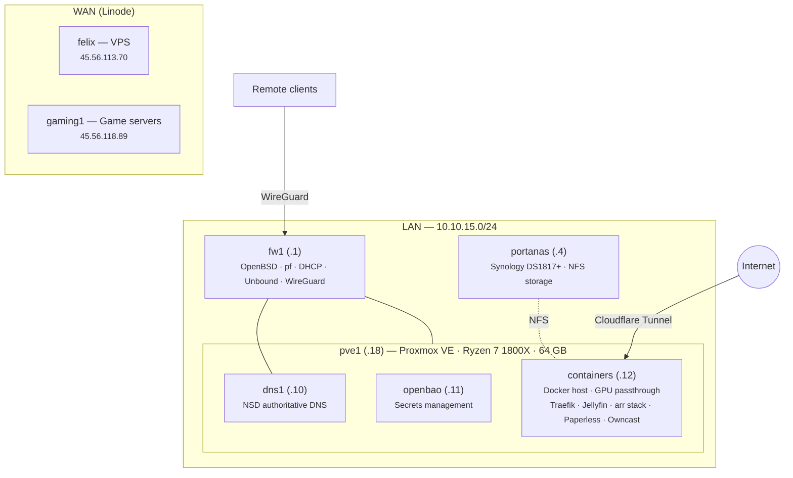

# Hardware

Physical and virtual hardware in the homelab.

## Infrastructure overview

## Physical hosts

### pve1 — Proxmox VE hypervisor

The sole physical server, running Proxmox VE. All local VMs run on this host.

| Component | Spec |
|-----------|------|
| Motherboard | Gigabyte AX370-Gaming-CF (AM4) |
| CPU | AMD Ryzen 7 1800X — 8 cores / 16 threads @ 3.6 GHz |
| Memory | 64 GB DDR4 |
| Boot disk | 250 GB SATA SSD (WDS250G1B0B) |
| Data disk | 1 TB SATA HDD (WDC WD10EZEX) |
| GPU | NVIDIA GeForce GTX 1050 Ti GP107 (passed through to containers VM) |
| NIC | Realtek RTL8111 PCIe Gigabit |
| Hypervisor | Proxmox VE 9.1.4 (kernel 6.17.4-2-pve) |

### fw1 — OpenBSD firewall

Protectli Vault FW4B. Runs OpenBSD. Serves as the LAN gateway, DHCP server, recursive DNS resolver (Unbound), and WireGuard VPN endpoint.

| Component | Spec |
|-----------|------|
| Model | Protectli Vault FW4B |
| CPU | Intel Celeron J3160 — 4 cores @ 1.60 GHz |
| Memory | 2.7 GB DDR3L |
| Boot disk | 128 GB mSATA SSD (BIWIN) |
| NICs | 4x Intel Gigabit (em0–em3) |
| OS | OpenBSD 7.1 (i386) |

NIC assignments: em0 (WAN), em1 (LAN — 10.10.15.1), em2–em3 unused.

### portanas — Synology NAS

Synology DS1817+. Provides NFS exports for media, documents, and backups.

| Component | Spec |
|-----------|------|
| Model | Synology DS1817+ |
| CPU | Intel Atom C2538 — 4 cores @ 2.40 GHz |
| Memory | 8 GB DDR3 |
| Drive bays | 8 (6 populated) |
| Drives | 6x WD Red Pro 6 TB (WD6002FFWX) |
| RAID | RAID 5 — ~27 TB usable (6.3 TB used, 24%) |
| USB | Seagate 8 TB external at /volumeUSB1 |
| NICs | 4x Gigabit (eth0–eth3, only eth0 active) |
| DSM | 7.1.1-42962 Update 9 |

## Virtual machines

All VMs run on pve1 and are provisioned via OpenTofu (see `tofu/`). Base image is Debian stable cloud image.

| VM | ID | vCPU | RAM | Disk | Purpose |
|----|-----|------|-----|------|---------|
| **dns1** | 101 | 1 | 512 MB | 8 GB | NSD authoritative DNS |
| **containers** | 102 | 4 | 8 GB | 64 GB | Docker host (Traefik, Jellyfin, arr stack, Paperless, Owncast) |
| **openbao** | 103 | 1 | 2 GB | 20 GB | Secrets management |

The containers VM also has the GTX 1050 Ti passed through for Jellyfin hardware transcoding (NVENC).

## External hosts

| Host | Provider | Purpose |
|------|----------|---------|
| **felix** | Linode | VPS |
| **gaming1** | Linode | Game servers (LinuxGSM) |
