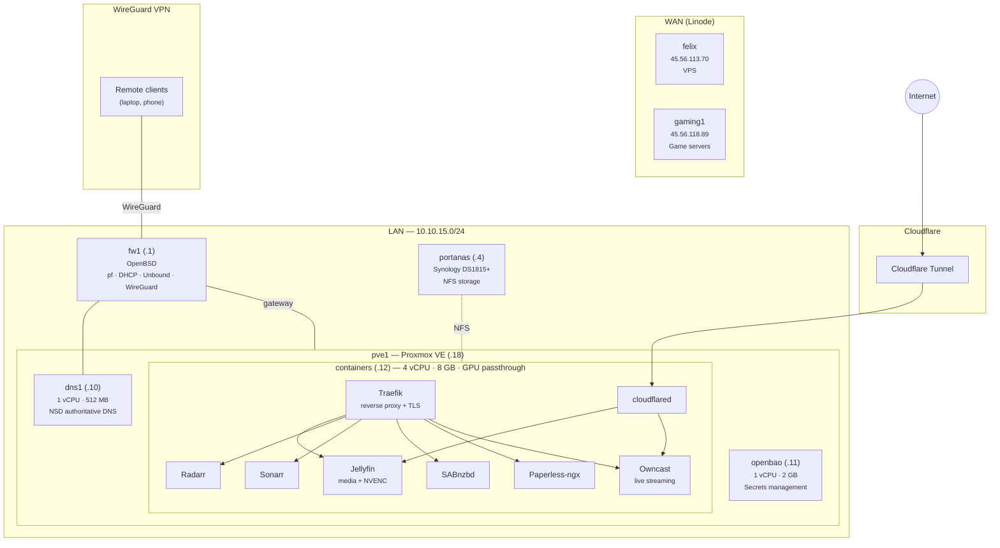

# Hardware

Physical and virtual hardware in the homelab.

## Infrastructure overview

## Physical hosts

### pve1 — Proxmox VE hypervisor

The sole physical server, running Proxmox VE. All local VMs run on this host.

| Component | Spec |
|-----------|------|
| Motherboard | Gigabyte AX370-Gaming-CF (AM4) |
| CPU | AMD Ryzen 7 1800X — 8 cores / 16 threads @ 3.6 GHz |
| Memory | 64 GB DDR4 |
| Boot disk | 250 GB SATA SSD (WD Blue) |
| Data disk | 1 TB SATA HDD (WD Blue) |
| GPU | NVIDIA GeForce GTX 1050 Ti (passed through to containers VM) |
| NIC | Realtek RTL8111 PCIe Gigabit |

### fw1 — OpenBSD firewall

<!-- TODO: document hardware specs -->

Runs OpenBSD. Serves as the LAN gateway, DHCP server, recursive DNS resolver (Unbound), and WireGuard VPN endpoint.

### portanas — Synology NAS

<!-- TODO: document model and drive configuration -->

Synology DS1815+. Provides NFS exports for media, documents, and backups.

## Virtual machines

All VMs run on pve1 and are provisioned via OpenTofu (see `tofu/`). Base image is Debian stable cloud image.

| VM | ID | vCPU | RAM | Disk | Purpose |
|----|-----|------|-----|------|---------|
| **dns1** | 101 | 1 | 512 MB | 8 GB | NSD authoritative DNS |
| **containers** | 102 | 4 | 8 GB | 64 GB | Docker host (Traefik, Jellyfin, arr stack, Paperless, Owncast) |
| **openbao** | 103 | 1 | 2 GB | 20 GB | Secrets management |

The containers VM also has the GTX 1050 Ti passed through for Jellyfin hardware transcoding (NVENC).

## External hosts

| Host | Provider | Purpose |
|------|----------|---------|
| **felix** | Linode | VPS |
| **gaming1** | Linode | Game servers (LinuxGSM) |
